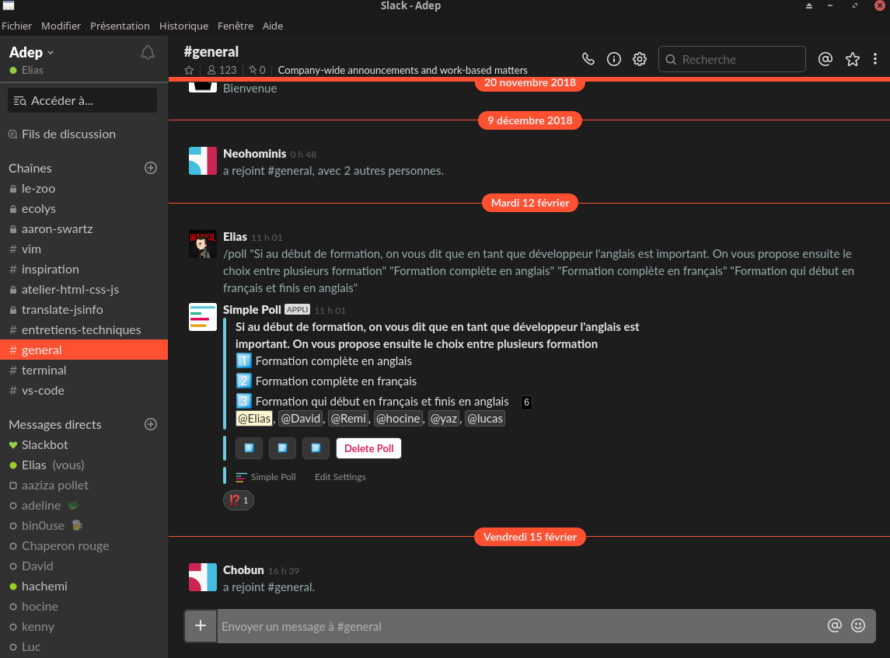

# slack-dark-theme



```
document.addEventListener('DOMContentLoaded', function() {

    let tt__customCss = `
    /* background current channel */
    body, .channel_header, #footer, .channel_title_info, #channel_topic_text, .p-message_pane .c-message_list.c-virtual_list--scrollbar > .c-scrollbar__hider { background: #1d1d1d; }
    /* text message */
    .c-message__body { color: rgb(153, 174, 177); }
    /* unread popup */
    .c-message_list__unread_divider__label, .p-message_pane__unread_banner__banner, .c-mrkdwn__member--mention { background: #ff5132 !important; }
    /* message in popup unread */
    .p-message_pane__unread_banner__banner {text-shadow: none;}
    /* button right in popup unread */
    .p-message_pane__unread_banner__close { background: #ff5132; }
    .p-message_pane__unread_banner__close:hover { background: #d14329; }
    /* unread divider separator */
    .c-message_list__unread_divider__separator {border-color: #ff5132; }
    /* text right of unread divider */
    .c-message_list__unread_divider__label {color: #fff !important;}
    /* team menu top of channel sidebar */
    #team_menu {background: #2d2d2d;}
    /* channel sidebar */
    .p-channel_sidebar { background: #313131 !important; }
    /* jumper in sidebar */
    .p-channel_sidebar__jumper { background: #1d1d1d !important;}
    /* mentions in channel sidebar */
    .p-channel_sidebar__badge, .p-channel_sidebar__banner--mentions {background: #ff5132 !important;}
    /* little green circle presence */
    .c-presence--active {color: #98ce25 !important;}
    /* channel sidebar selected*/
    nav.p-channel_sidebar .p-channel_sidebar__channel--selected, .p-channel_sidebar__link--selected, .c-message_list__day_divider__label__pill, .p-message_pane .c-message_list.c-virtual_list--scrollbar > .c-scrollbar__hider:before { color: #eee !important; background: #ff5132 !important; }
    /* member link */
    .c-mrkdwn__member--link { background: #626f71; color: #7e8f91 !important; }
    /* day divider line */
    .c-message_list__day_divider__line { border-top-color: #ff5132 !important}
    /* form input bottom on current channel */
    #msg_input, #primary_file_button { background: #696969 !important; }
    #msg_form #msg_input { border-color: transparent; }
    #msg_input.texty_legacy .ql-placeholder, .c-message_kit__file__meta { color: #fff; opacity: 0.5; }
    /* message starred */
    .c-message--starred { background: #1d1d1d; }
    /* pane showing like files share */
    #client-ui.flex_pane_showing #col_flex, #col_flex { border-left-color: #000; }
    #flex_contents, #threads_msgs_scroller_div, ts-thread { background: #303030 }
    #flex_contents .heading, .p-flexpane_header, ts-thread .thread_messages { background: rgba(0,0,0,0.5); }
    /* color for hower in burger menu in top right corner */
    .menu ul li.highlighted a:not(.inline_menu_link), .menu:not(.keyboard_active) ul li:hover:not(.disabled) a:not(.inline_menu_link), .menu:not(.keyboard_active) ul li:hover:not(.disabled) button:not(.inline_menu_link) {background: #ff5132; }
    /* link text */
    .c-link--button { color: #ff5132; }
    /* lin text hover */
    .c-link--button:active, .c-link--button:hover { color: #d14329; }

    `;
    $.ajax({
url: 'https://cdn.rawgit.com/laCour/slack-night-mode/master/css/raw/black.css',
success: function(css) {
$('<style></style>').appendTo('head').html(css + tt__customCss);
}
});
});
```
